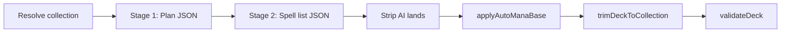

# MTG Deckbuilder — agent handoff

**Start here:** In a new Cursor chat, say: *"Read `HANDOFF.md` in the repo root before changing anything."*

This file captures project state as of **May 2026**. It is the handoff from a long quality/debugging session; update it when major behavior changes.

---

## What this app is

Next.js app that builds Magic: The Gathering decks from a pasted/uploaded collection using OpenAI. User picks format, colors, strategy, lands slider, optional commander, then builds via streaming API.

- **UI:** `src/components/deck-builder/*`, `DeckBuilderApp.tsx`
- **API:** `src/app/api/build-deck`, `build-deck-stream`, `refine-deck`, `shore-up-deck`, `resolve-collection`, `swap-card`
- **AI:** `src/lib/ai/*` (not `ai-deckbuilder.ts` — deleted)
- **Trim / validation:** `src/lib/ai/trim.ts`, `src/lib/deck-validation.ts`

Read `AGENTS.md` for the Next.js 16 warning (APIs differ from training data; check `node_modules/next/dist/docs/`).

---

## AI deck build pipeline (current design)



### Stage 1 — plan (`generatePlan` in `generation.ts`)

- Prompts: `planSystemPrompt`, `planUserPrompt` in `prompts.ts`
- Schema: `deckPlanSchema` in `deck-schema.ts` (commander, archetype, roleCounts, keyCards, …)
- Skipped for refine/shore-up (`extraMessages` non-empty)

### Stage 2 — build (`runDeckGeneration`)

- Plan locked in as assistant message + `buildExecutionUserMessage(plan, format, spellTarget)`
- **Spells only:** collection prompt **excludes all lands** (`collection-prompt.ts`)
- AI must return exactly `spellTarget` non-land cards (99 − lands slider for Commander, 60 − lands for 60-card)
- Any lands in AI output are stripped; mana base is injected after

### Auto mana base (`src/lib/ai/mana-base.ts`)

After AI returns spells:

1. Strip any lands the model included anyway
2. **Commander:** add owned utility staples from a fixed list (Command Tower, Exotic Orchard, …), capped at ~25% of land count, filtered by commander color identity
3. Fill remainder with **virtual basics** (from `STUB_BASIC_LANDS` in `basic-lands.ts`), split by **mana pip weight** across deck colors (or even split if no pips)

Lands count comes from `brewPrefs.landsTarget` or defaults: **36 Commander / 23 Modern**.

### Trim (`trim.ts`)

- Enforces collection ownership, legality, color identity, ban list, house rules
- **Chosen commander:** `brewPrefs.chosenCommander` — user pick from `ReviewStep`; trim locks commander and may keep it even when color prefs conflict (warns instead of dropping)
- Land floor/ceiling logic still exists for edge cases; primary mana base is now `applyAutoManaBase`, not AI + basic padding

### Strict size gates (`generation.ts`) — **main pain point**

- **Pre-trim:** if `spellSum !== spellTarget`, **retry** (up to `maxAttempts`, currently **6** in `flows.ts` `buildDeckWithAI`)
- **Post-trim:** if mainboard + commander ≠ 100 (Commander) or main ≠ 60, **retry**
- After all attempts: **throws** → API 500 with message like *"Couldn't build a complete commander deck after 6 attempts…"*

**Why users see failures with huge collections:** The model often returns 50–60 spells instead of 63; six full plan+build API rounds take minutes, then hard fail. **Intended fix (not done yet):** relax pre-trim spell gate — accept short spell lists, pad to 100 with auto mana base + optional duplicate spells from collection, or pad spells from collection heuristically. User wants **exactly 100 cards shipped**, not six retries.

---

## Features already on `cursor/deck-build-quality`

| Feature | Where |
|--------|--------|
| Two-stage plan → build | `generation.ts`, `prompts.ts`, `deck-schema.ts` |
| CMC / oracle in collection prompts | `collection-prompt.ts`, `collection.ts` |
| Optional commander picker (Commander only) | `ReviewStep.tsx`, `use-deck-prefs.ts`, `commander-candidates.ts`, trim + prompts |
| Strict deck size (no short decks) | `generation.ts` — **too strict for production** |
| Auto mana base | `mana-base.ts`, wired in `generation.ts` |
| Shore-up / refine | `flows.ts` — skip planning, use `extraMessages` |
| Stress test script | `scripts/stress-test-build.mjs` (dev only) |

---

## Git / branches

- **`main`:** two-stage generation + stress script (`2da3fd7`, `772956d`)
- **`cursor/deck-build-quality`:** commander picker, strict size, auto mana base (commits `5809194`, `3c83346`, `32f1599` — last message is placeholder `"a"`)
- All old `cursor/*` feature branches were deleted; do not resurrect `ai-deckbuilder.ts`

**Verify before merging:** `npm test` (54 tests), `npm run build`, `npm run lint`.

---

## Environment

`.env.local` (not committed):

```env
OPENAI_API_KEY=sk-...
OPENAI_MODEL=gpt-4o   # default in code is gpt-4o-mini; user prefers gpt-4o for quality
```

Restart `npm run dev` after env changes. Run from **`~/mtg-deckbuilder`**, not `~`.

---

## Prefs / API wiring (reference)

End-to-end pattern for a new brew field:

1. `src/lib/deck-preferences.ts` — `DeckBuildPreferences`
2. `src/lib/api-brew-body.ts` — zod + `brewPreferencesFromBody`
3. `src/lib/api-schemas.ts` — `brewRequestFields` spread
4. `src/components/deck-builder/use-deck-prefs.ts` — state + `brewPayload`
5. `src/components/deck-builder/ReviewStep.tsx` — UI
6. `src/lib/ai/prompts.ts` / `generation.ts` / `trim.ts` — behavior

Examples: `landsTarget`, `chosenCommander`, `mustIncludeCards`, `powerLevel`.

---

## Commands

```bash
cd ~/mtg-deckbuilder
npm run dev          # note port if 3000 busy
npm test
npm run build
npm run lint

# Optional local API stress (needs dev server):
BASE_URL=http://localhost:3000 node scripts/stress-test-build.mjs modern
BASE_URL=http://localhost:3000 node scripts/stress-test-build.mjs commander
```

---

## Coding conventions (user preferences)

- Minimal scope; match existing style; no drive-by refactors
- No narrating comments; no emojis in code
- Stage named files only for commits — no `git add .`
- Do not commit unless asked; do not push unless asked
- Only create commits when user requests

---

## Suggested next tasks (priority)

1. **Fix build reliability + speed:** Remove or soften exact `spellTarget` pre-trim retry; after AI returns, `applyAutoManaBase` + pad spells to fill 99/60 (or one retry max). Goal: always return 100-card Commander when collection is large enough.
2. **Amend commit message** on `32f1599` if merging (currently `"a"`).
3. **Merge `cursor/deck-build-quality` → `main`** after (1) and user testing.
4. **Vercel:** set `OPENAI_MODEL` in dashboard; redeploy after merge.

---

## Deep history

Long session transcript (decisions, stress tests, PR split plan):

`~/.cursor/projects/Users-benw-mtg-deckbuilder/agent-transcripts/95742948-7450-4730-b86d-1c936c803145/95742948-7450-4730-b86d-1c936c803145.jsonl`

Search keywords: `two-stage`, `landsTarget`, `chosenCommander`, `applyAutoManaBase`, `spellTarget`, `Couldn't build a complete`.

---

## Quick file map

```
src/lib/ai/
  generation.ts      # plan + runDeckGeneration + size gates + mana base hookup
  flows.ts           # buildDeckWithAI, shoreUp, refine, swap
  prompts.ts         # plan/build/system/user prompts
  collection-prompt.ts  # collection text for AI (no lands)
  mana-base.ts       # applyAutoManaBase, spellTargetFor
  trim.ts            # post-AI normalization
  deck-schema.ts     # Zod schemas
src/lib/commander-candidates.ts
src/lib/deck-validation.ts
src/lib/formats.ts
src/lib/basic-lands.ts
```
